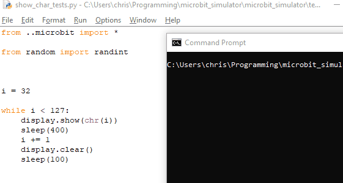
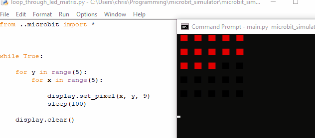
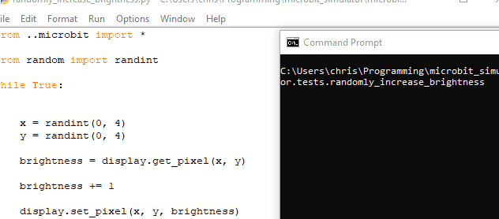
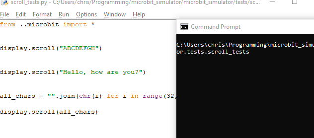
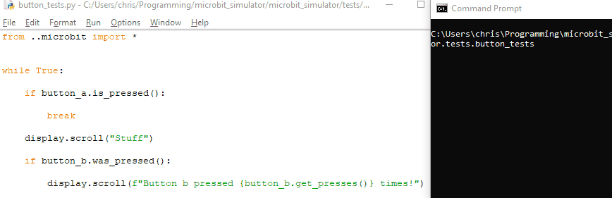
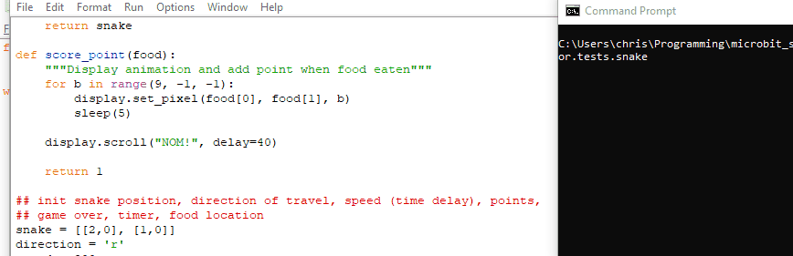

# microbit_simulator

## Justification

I have no USB cables at work, and using standard CLI Python to introduce the Year 8s to programming for the first time did not work:

	from time import sleep

	while True:
		print("Turn top left LED on!")
		sleep(1)  # here it's 1 second, in your code it's ms!
		print("Turn all LEDS off.")
		sleep(1)

This was waayy too much cognitive load, seen as every student in the class was writing code for their micro:bit using Mu. This led to much confusion such as:
	
	from time import sleep
	from microbit import *

	while True:
		display.set_pixel(0, 0, 9)
		sleep(1)
		print("Turn all LEDS off.")

etc.

This led me down the path of creating a BBC micro:bit simulator that will run in the command line.

## Implemented so far

- `display.show()` can be used to display single ASCII characters

- `display.set_pixel()` can turn individual LEDs on

- the discovery that 8-bit colour can be used in Windows CMD was a revelation, meaning it was very easy to implement the 10 different brightnesses.

For reference: this can be achieved purely in the standard library, using the ANSI code format: `"\033[38;2;255;255;0m"` (in this case, YELLOW)

- `display.scroll()` to scroll text

- `button_a.was_pressed()` support - this works well, but `is_pressed()` needs some bugfixes.

- put this all together, and it manages to run my micro:bit Snake code from 2016!

### Next steps

- A sort of VM hardware-like emulation approach to mock accelerometer, thermometer etc. input?
- Re-implementation of the micro:bit's `music` library using `winsound`?